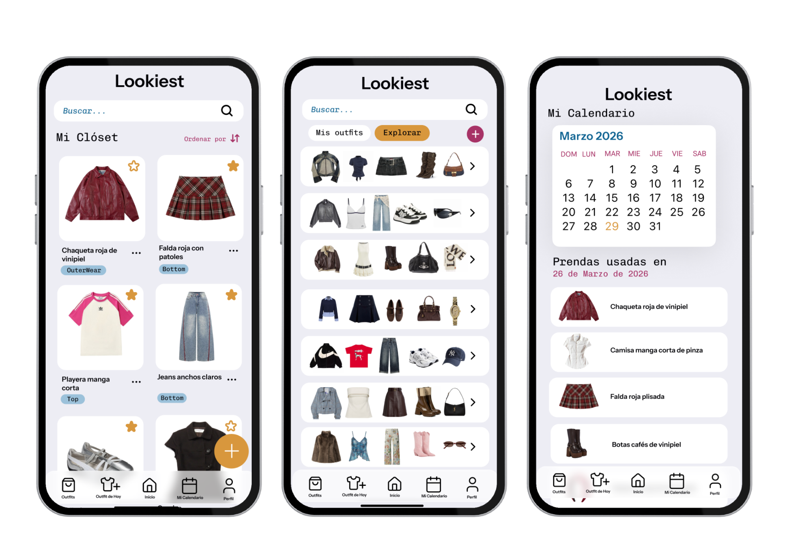

# Lookiest ✨📱

Android app for managing your digital closet: save your clothes, put together outfits, plan what to wear each day, and keep track of usage — all with cloud sync.
 


## Screens
 

Closet | Outfits | Calendar 

 
## Features

- **Authentication**: sign-up, login, password change, and biometric unlock (fingerprint/face).
- **My Closet**: add, edit, and delete clothing items with photos (camera or gallery).
- **Outfits**: create and edit outfits by combining items from your closet, with public/private visibility.
- **Outfit of the Day**: suggest/select the outfit to wear for the day.
- **Calendar**: history of which outfit was worn on each day.
- **Profile**: edit user data.
- **Sync**: local database (Room) with backup and remote sync (Firebase Firestore), with images hosted on Cloudinary.


## Architecture
 
The app follows an **MVVM (Model-View-ViewModel)** architecture with a repository layer, which keeps the UI decoupled from data sources:
 
- **View** — Jetpack Compose screens (`ui/theme/screens`) and reusable components (`ui/theme/components`).
- **ViewModel** — `viewModel/` holds UI state and business logic, exposed to Compose via state.
- **Model / Data** — `data/` contains entities, DAOs, and repositories that abstract both the local **Room** database and the remote **Firebase Firestore** source, keeping the rest of the app agnostic to where the data comes from.
- **Navigation** — a single navigation graph (`AppNavigationController`) drives screen-to-screen flow.
This separation makes each layer independently testable and makes it possible to evolve the local/remote sync strategy without touching the UI.
 

## Tech Stack

- **Language**: Kotlin
- **UI**: Jetpack Compose (Material 3)
- **Navigation**: Navigation Compose
- **Local persistence**: Room
- **Preferences**: DataStore
- **Backend / Auth**: Firebase (Auth, Firestore, Analytics)
- **Images**: Cloudinary (upload) + Coil (loading/caching)
- **Biometrics**: AndroidX Biometric
- **Build**: Gradle (Kotlin DSL) + KSP

Minimum requirements: `minSdk 24`, `targetSdk`/`compileSdk 35`.

## Project Structure

```
app/src/main/java/ruiz/marisol/lookiest/
├── data/            # Entities, DAOs, repositories, Room DB, Cloudinary and sync
│   └── DAO/
├── navigation/       # Navigation graph (AppNavigationController)
├── viewModel/        # ViewModels (Auth, Closet) and their factories
└── ui/theme/
    ├── screens/      # Screens (Login, Closet, Outfits, Profile, Calendar, etc.)
    └── components/   # Reusable components (cards, chips, dialogs, camera, etc.)
```

## Initial Setup

Before building, two things need to be configured that are **not** version-controlled since they contain sensitive data:

1. **Firebase**: place your `google-services.json` in `app/`. You'll need a Firebase project with **Authentication** and **Firestore** enabled.
2. **Cloudinary**: add your credentials in `local.properties` (at the project root):

   ```properties
   sdk.dir=/path/to/your/Android/sdk
   CLOUDINARY_CLOUD_NAME=your_cloud_name
   CLOUDINARY_API_KEY=your_api_key
   ```

   These values are exposed to the app via `BuildConfig` (see `app/build.gradle.kts`).

## Build and Run

```bash
./gradlew assembleDebug     # builds the debug APK
./gradlew installDebug      # installs on a connected device/emulator
```

You can also open the project in Android Studio and run it directly.

### Tests

```bash
./gradlew test                # unit tests
./gradlew connectedAndroidTest # instrumented tests (requires a device/emulator)
```

## Permissions

- `READ_MEDIA_IMAGES`: to select clothing photos from the gallery.
- Camera access (via `FileProvider`) to take photos of clothing items directly from the app.
